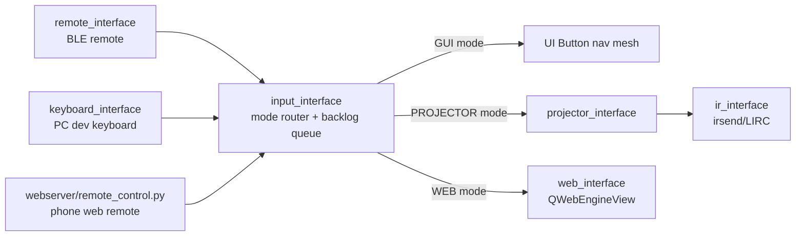

# Interface Layer (`py/interface/`)

This folder contains the app's hardware/system abstraction layer. Each module wraps one external
capability (Bluetooth remote, IR blaster, projector, OS commands, web browsing, etc.) behind a
class, and exposes a **module-level singleton instance** created at import time (e.g.
`inputInterface`, `remoteInterface`). The rest of the app imports these singletons directly —
never construct a second instance.

## Core pattern

- **One class per module, one singleton per module.** The singleton is instantiated at the bottom
  of each file (`inputInterface = InputInterface()`, etc.).
- **Late wiring, not constructor wiring.** Interfaces are created "empty" and cross-linked later
  via setters in `py/main.py`'s module-level setup block (`inputInterface.setProjectorInterface(...)`,
  `remoteInterface.setInputInterface(...)`, `webInterface.setInputInterface(...)`, ...). This avoids
  circular imports between interface modules. The one deliberate exception:
  `projector_interface.py` imports `irInterface` directly at module level (commented in-file as a
  simplicity trade-off).
- **Defensive null checks.** Because links are set post-construction, every interface tolerates a
  missing collaborator (`if self.getProjectorInterface() is not None: ...`) and logs/prints instead
  of crashing.
- **Async command surface.** User-facing actions (`select()`, `navigate()`, `powerOff()`,
  `connectToNetwork()`, ...) are `async def` and run on the Qt-integrated asyncio loop (qtinter).
  OS commands use async subprocess runners so they don't block the UI.
- **Testability via injectable dependencies.** Newer interfaces (`system`, `git`, `wifi`) accept
  constructor overrides (`command_runner`, `teardown`, `quit_app`, `is_raspberry_pi`, ...) that
  default to the real implementations. Preserve this pattern when adding OS-touching interfaces.
- **Pi vs PC awareness.** Interfaces that touch real hardware/OS gate on `DEVICE.IS_RASPBERRY_PI`
  from `globals.py` and degrade gracefully on a dev PC (IR sends are skipped, reboot is skipped,
  Bleak gets the WinRT `allow_sta()` workaround on Windows).
- **Logging.** Newer modules use `app_logging.get_adapter(...)` (see `LOGGING.md`); older ones
  (`input`, `keyboard`, `projector`, `web`) still use bare `print`. Prefer the logger for new code.

## Input routing architecture

The central piece is **`input_interface.py`** — everything user-input-related funnels through it:

Key behaviors to preserve:

- **Input sources are dumb; `InputInterface.receive(data)` is the single entry point.** Sources
  (`remote_interface`, `keyboard_interface`, the webserver remote) translate their raw events into
  the shared string tokens from `globals.INPUT` (`RELEASED_PREFIX`, `NAV_PREFIX`, `POWER`, ...) and
  call `receive()`. They never implement behavior themselves.
- **Backlog queue.** `receive()` appends to a backlog and processes it sequentially via
  `processBacklog()`; only one processing task runs at a time so rapid button presses can't
  interleave async handlers. Per-input exceptions are caught so one bad input can't kill the queue.
- **Mode state machine.** `InputInterface` routes every command based on its current mode
  (`INPUT.MODES.GUI | PROJECTOR | WEB | OTHER`):
  - `GUI` — drives the on-screen `Button` navigation mesh (selection outline is painted by
    `InputInterface` itself, which *is* a `CustomQLabel` overlay widget).
  - `PROJECTOR` — forwards nav/select/back to the projector's own OSD menu via IR.
  - `WEB` — forwards to `web_interface`'s JS spatial-navigation helpers.
  - `OTHER` — projector is on a non-HDMI input channel; most GUI input is suppressed until `home`.
  - `__oldMode` allows temporary excursions (e.g. volume keys briefly touch projector mode and
    then restore).
- **`powerOff` goes through `teardown.teardown_app(...)`** — never duplicate shutdown logic here
  (see repo convention in `.github/copilot-instructions.md`).

## Module summaries

| Module | Singleton | Role |
| --- | --- | --- |
| `input_interface.py` | `inputInterface` | Central input router/state machine + on-screen selection outline widget. Owns the input backlog queue. |
| `remote_interface.py` | `remoteInterface` | BLE client (bleak) for the custom Bluetooth remote. Endless scan/connect/reconnect loop (`connect()`), keep-alive polling, forwards decoded signals to `inputInterface`. Power-off input also triggers BLE disconnect. |
| `keyboard_interface.py` | `keyboardInterface` | Dev-only input source: maps Qt key codes (via `INPUT.LOOKUP`) to the same input tokens the remote sends. Wired to the main window in `main.py`. |
| `ir_interface.py` | `irInterface` | Lowest-level output: shells out to `irsend` (LIRC, config in `projector/projector.lircd.conf`) to emit Epson remote codes. No-ops on non-Pi devices. Synchronous — delay pacing is the projector interface's job. |
| `projector_interface.py` | `projectorInterface` | Semantic projector commands (`on`, `select`, `navUp`, `volUp`, `switchInputChannel`, ...) built on `irInterface.send()` with `PROJECTOR.INPUT_DELAY` pacing between codes. `off()` is intentionally stubbed out for now. HDMI switching is done via VGA→SEARCH because there is no direct HDMI code. |
| `web_interface.py` | `webInterface` | Full-screen `QWebEngineView` for smart-TV web browsing (see `WEB_INTEGRATION.md`). Installs custom spatial-nav JS (`window.__broNav`) as a profile-level script for D-pad focus movement, reports the focused element back as a `FocusedElement` (duck-typed `.rect` contract that `inputInterface.setSelectedButton()` accepts). Detects "player mode" (fullscreen/full-viewport video) and forwards real key events for playback control. Configures profiles for browser parity (DRM plugins, autoplay, fullscreen, popups, persistent logins), handles incognito profiles, browser-like RETURN (fullscreen exit → history back → close), renderer-crash auto-reload, and hands off text entry to the GUI keyboard overlay (dropping to GUI mode while it is open). |
| `system_interface.py` | `systemInterface` | App restart, shutdown, and device reboot. Restart/reboot call `launch_signals.request_skip_standby()` and go through `teardown_app` **without** a projector interface (projector deliberately stays on). Shutdown consults `configInterface.getProjectorOffOnShutdown()` (wired via `setConfigInterface()`) to decide whether to pass the projector interface to `teardown_app` at all. Reboot writes the reboot-pending flag *before* running `sudo shutdown -r now` (see launcher docs in `.github/copilot-instructions.md`). |
| `git_interface.py` | `gitInterface` | Branch selection for the updater. Read-only branch discovery from `refs/remotes/origin`; `switchBranch()` only writes the branch file — `launcher/update` performs the actual checkout/pull on next restart. |
| `wifi_interface.py` | `wifiInterface` | Wi-Fi scanning/connecting via `nmcli` (with `iwgetid` fallback for current-SSID only). Persists known networks + passwords to a JSON file (`WIFI.KNOWN_NETWORKS_FILE`). `Network` dataclass is the data contract used by the Wi-Fi UI overlay. |
| `config_interface.py` | `configInterface` | Generic persisted key/value settings store (JSON file at `CONFIG.STORAGE_FILE`, gitignored). Seeded from `CONFIG.DEFAULTS`; extension point for future persisted settings. Currently backs `projector_off_on_shutdown`, consumed by `system_interface.py`. |

## Consumers

- `py/main.py` — imports and cross-wires the singletons (both startup paths run this module-level setup).
- `py/launch.py` — Pi path; also lists interface modules in its hot-reload list (note
  `interface.remote_interface` is excluded from reload to keep the live BLE connection).
- `py/ui/settings_screen.py`, `py/ui/wifi_overlay.py`, `py/ui/tools/tile.py` — UI consumers of
  `gitInterface`/`systemInterface`/`wifiInterface`/`webInterface`/`configInterface`.
- `py/webserver/remote_control.py` — phone web remote, injects inputs via `inputInterface.receive()`.

## Adding a new interface

1. Create `py/interface/<name>_interface.py` with one class and a bottom-of-file singleton.
2. Use `app_logging.get_adapter(...)` for logging (read `LOGGING.md` first).
3. Accept injectable dependencies (command runners, flags) with real defaults, for testability.
4. Gate hardware/OS side effects on `DEVICE.IS_RASPBERRY_PI` and degrade gracefully on PC.
5. If it needs another interface, link it via a setter from `main.py`'s wiring block — do not
   import interface singletons from each other (the `projector → ir` import is the lone exception).
6. If it participates in shutdown, route through `py/teardown.py`'s `teardown_app(...)`.
